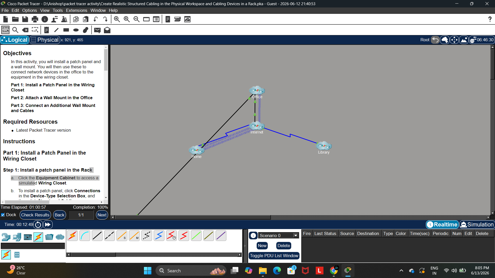
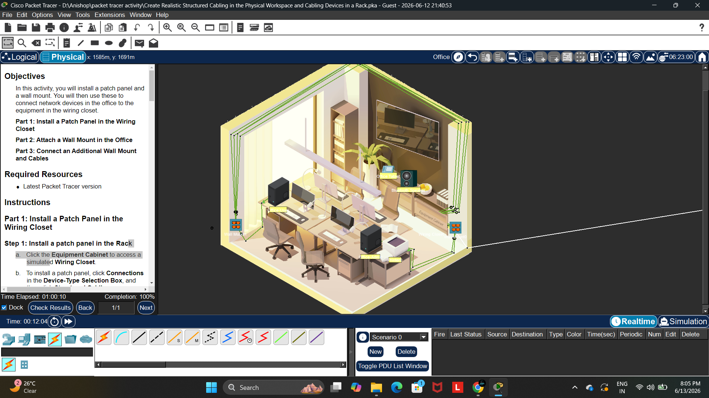
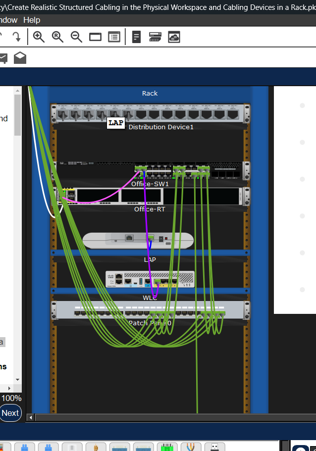

# Packet Tracer Labs

Cisco Packet Tracer networking labs including structured cabling, VLANs, routing, switching, troubleshooting, and CCNA practice projects.

## Projects

### Structured Cabling and Rack Design Lab

📁 Open: `structured-cabling-lab`

This project demonstrates:

- Structured Cabling
- Physical Workspace Design
- Rack Installation
- Cable Management
- Network Documentation

